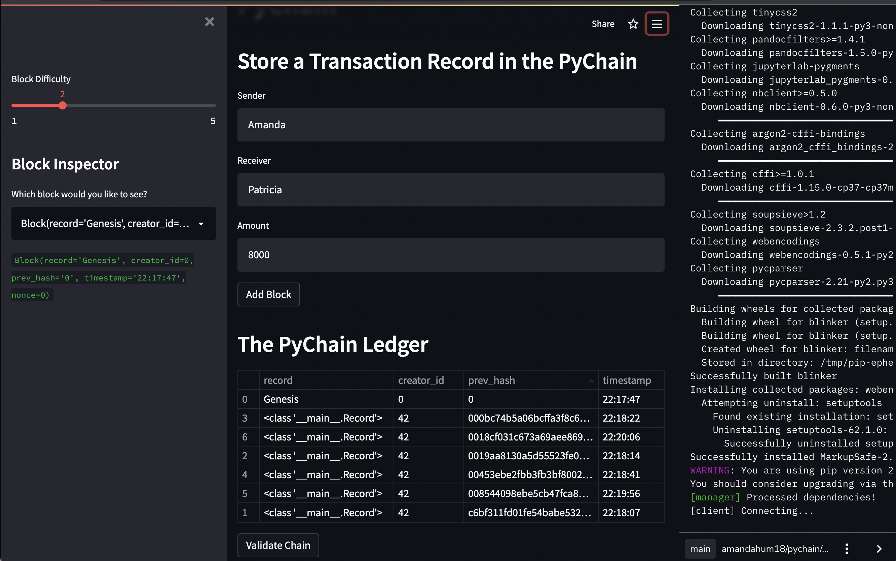
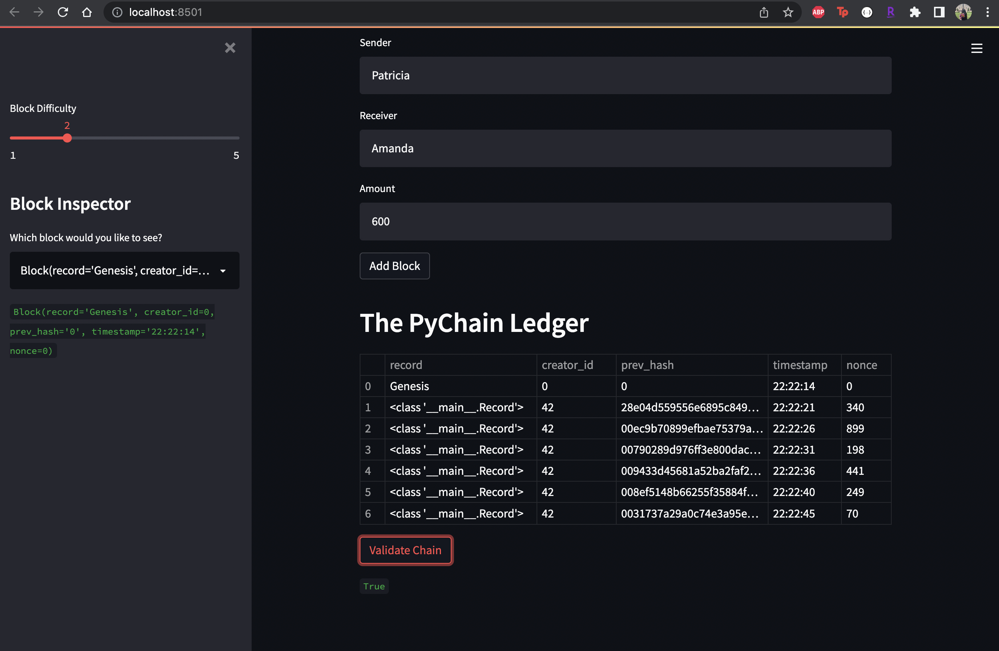

# Pychain

This is a blockchain-based ledger system that utilizes Streamlit to create a user-friendly web interface in which the partner banks can interact with in order to conduct financial transactions between senders and receivers. The system will be able to verify the integrity of the data in the ledger as well. 

---

## Required Modules/Libraries

Streamlit -- an open-source app framework that allows users to set up an application with simple API; turns data scripts into shareable web apps in minutes

---

## Screenshots

